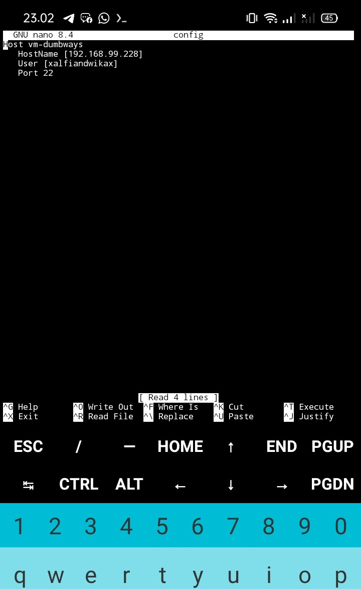
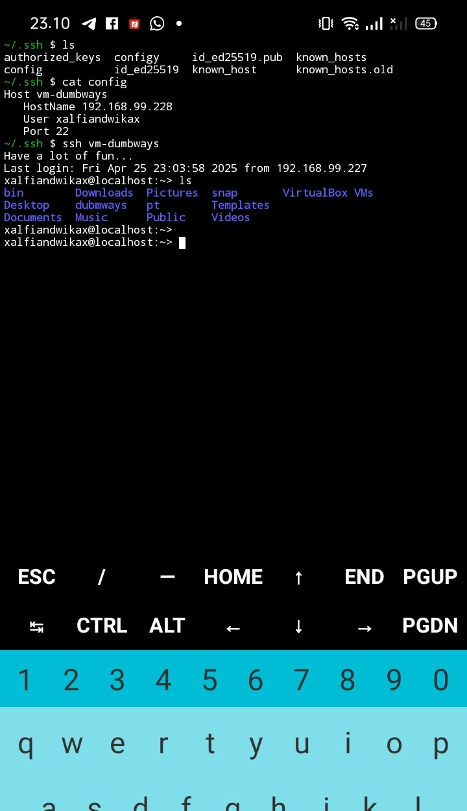

## 1.Bisa ssh kedalam server dengan contoh command : `ssh vm-dumbways`
1. buka cmd kali ini saya memakai termux sebagai client
2. masuk kedalam repository ``` ~/.ssh ``` didalam repositori terdapat banyak file hasil generate ssh-keygen 
3. edit file config, jika belum ada file config buat telebih dahulu dengan perintah ``` touch config ```
   
4. masuk kedalam text editor dengan peintah ``` nano config ``` lalu isi script berikut 

```bash
Host vm-dumbways
    HostName 192.168.99.228
    User xalfiandwikax                  
    Port 22                          
```

5. lalu save script dengan perintah ``` ctrl+x ``` lalu jalankan dengan perintah

   ```bash
   ssh vm-dumbways

   ```
 > 

## 2. Rubah port SSH menjadi 6969

**Sebelum merubah port SSH menjadi 6969** kita lihat terlebih dahulu semua service yang sedang berjalan beserta port nya dengan perintah ``` sudo ss -tulnp ``` dengan hasil

```bash
xalfiandwikax@localhost:~/Documents/Alfian/devops23-dumbways-Alfian> sudo ss -tulnp
Netid State  Recv-Q Send-Q       Local Address:Port    Peer Address:Port Process                                                  
udp   UNCONN 0      0                  0.0.0.0:5353         0.0.0.0:*     users:(("avahi-daemon",pid=1121,fd=11))                 
udp   UNCONN 0      0                  0.0.0.0:51527        0.0.0.0:*     users:(("avahi-daemon",pid=1121,fd=13))                 
udp   UNCONN 0      0                10.16.3.1:53           0.0.0.0:*     users:(("dnsmasq",pid=2372,fd=6))                       
udp   UNCONN 0      0        0.0.0.0%mpqemubr0:67           0.0.0.0:*     users:(("dnsmasq",pid=2372,fd=4))                       
udp   UNCONN 0      0                     [::]:5353            [::]:*     users:(("avahi-daemon",pid=1121,fd=12))                 
udp   UNCONN 0      0                     [::]:38704           [::]:*     users:(("avahi-daemon",pid=1121,fd=14))                 
tcp   LISTEN 0      32               10.16.3.1:53           0.0.0.0:*     users:(("dnsmasq",pid=2372,fd=7))                       
tcp   LISTEN 0      4096               0.0.0.0:80           0.0.0.0:*     users:(("nginx",pid=2585,fd=6),("nginx",pid=2580,fd=6)) 
tcp   LISTEN 0      128                0.0.0.0:22           0.0.0.0:*     users:(("sshd",pid=1870,fd=3))                          
tcp   LISTEN 0      4096             127.0.0.1:631          0.0.0.0:*     users:(("cupsd",pid=1808,fd=7))                         
tcp   LISTEN 0      100              127.0.0.1:25           0.0.0.0:*     users:(("master",pid=2145,fd=13))                       
tcp   LISTEN 0      128                   [::]:22              [::]:*     users:(("sshd",pid=1870,fd=4))                          
tcp   LISTEN 0      100                  [::1]:25              [::]:*     users:(("master",pid=2145,fd=14))                       
tcp   LISTEN 0      4096                 [::1]:631             [::]:*     users:(("cupsd",pid=1808,fd=6))   

```
perhatikan output ``` tcp   LISTEN 0      128                   [::]:22              [::]:*     users:(("sshd",pid=1870,fd=4)) ``` yang artinya service sshd berjalan di port 22

1. langkah pertama adalah kita menambahkan port 6969 terlbih dahulu dengan perintah ``` firewalld-cmd --add-port=6969/tcp --permanent ``` lalu reload ``` firewalld-cmd --reload```

2. lalu cek port 6969 sudah terdaftar atau belum dengan perintah ``` firewalld-cmd --list-all ```

3. lalu pergi co repositori ``` /etc/ssh ``` edit file sshd_config dengan perintah ``` nano sshd_config ``` by default configurasi sshd_config berada di port 22 kita ubah menjadi port 6969
```bash
Port 6969
#AddressFamily any
#ListenAddress 0.0.0.0
#ListenAddress ::

```
4. restart service ssh dengan perintah ``` sudo systemctl restart sshd ``` 
5. lalu kita periksa kembali list port sshd dengan perintah ``` sudo ss -tulnp | grep sshd ``` dengan output

```bash
xalfiandwikax@localhost:/etc/ssh> sudo ss -tulnp | grep sshd
[sudo] password for root: 
tcp   LISTEN 0      128              0.0.0.0:6969       0.0.0.0:*    users:(("sshd",pid=11585,fd=3))                        
tcp   LISTEN 0      128                 [::]:6969          [::]:*    users:(("sshd",pid=11585,fd=4))                        
xalfiandwikax@localhost:/etc/ssh> 

```
6. kita coba remote dari client menggunakan termux, sebulum remote kita pastikan kita sudah mengubah port di file config menjadi ```6969``` sehingga berhasil untuk meremote.


