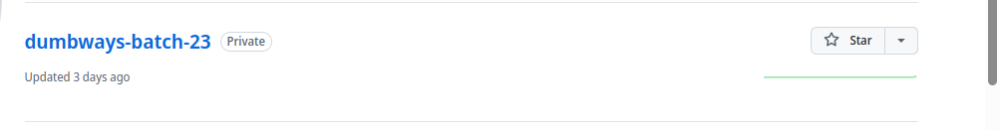

## 1. Repository dumbways-batch-23 dibuat private
1.  langkah pertama kita masuk ke akun github
2.  lalu masuk ke repositori yang ingin di private, kali ini repositori "dumways-batch-23" yang akan kita private.
3. pergi ke navbar settings, scroll ke bawah ke bagian chard Danger zone, lalu kli change visibility, pilih change to private. bisanya dimintai password github untuk proses validasi >


## 2. Demokan penggunaan Pull Request

1. buat repositori baru di lokal kita untuk menampung hasil pull request, atau bisa dengan printah ``` git init (namarepobaru)```

2. lalu kita meremote repositori github kita dengan perintah ``` git remote add -m set-url origin git@github.com:xalfiandwikax/devops23-dumbways-ALfian.git ``` 

3. lalu kita menarik semua resourch github kedalam repo lokal kita dengan perintah ``` git pull origin (namabranch) yang ingin di tarik ```.
```bash
xalfiandwikax@localhost:~/dubmways/alfian> git  remote add -m  set-url origin  git@github.com:xalfiandwikax/devops23-dumbways-Alfian.git
xalfiandwikax@localhost:~/dubmways/alfian> ls
xalfiandwikax@localhost:~/dubmways/alfian> git pull origin master
remote: Enumerating objects: 97, done.
remote: Counting objects: 100% (97/97), done.
remote: Compressing objects: 100% (68/68), done.
remote: Total 97 (delta 30), reused 58 (delta 15), pack-reused 0 (from 0)
Unpacking objects: 100% (97/97), 721.67 KiB | 691.00 KiB/s, done.
From github.com:xalfiandwikax/devops23-dumbways-Alfian
 * branch            master     -> FETCH_HEAD
 * [new branch]      master     -> origin/master
xalfiandwikax@localhost:~/dubmways/alfian> ls
Challenge  Day1  Day 2  Day3  Day4  nothing
xalfiandwikax@localhost:~/dubmways/alfian> 


```
