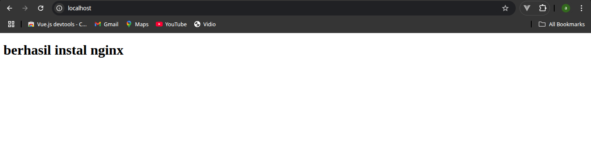

 ## Taks
 1. Jelaskan istilah DevOps dengan kata kunci : Continuous
 2. Buatlah 1 Virtual Machine (bebas ingin menggunakan Multipass, VMware, Virtualbox, etc)
 3. Install Nginx WebServer ke dalam Virtual Machine yang telah kalian buat..
 
 ## 1. Jelaskan istilah DevOps dengan kata kunci : Continuous
 - Devops adalah sebuah role untuk mengOrganisir para Developer/pengembang aplikasi agar lebih efesien dari tahap penulisan code sampai tahap deployment.
 sangat besar peran seorang devOps dalam Continous/keberlanjutan dalam artian keberlanjutan dalam pengembangan aplikasi. 
 DevOps adalah penghubung antara tim Development dan tim Operations yang bertugas untuk mempercepat proses development hingga produk dirilis ke publik.

- **Continuous Integration (CI):** Praktik menggabungkan (merge) kode dari banyak developer ke branch utama secara rutin, biasanya beberapa kali sehari. Setiap integrasi akan diuji secara otomatis agar bisa mendeteksi bug lebih awal.
- **Continuous Delivery (CD):** Proses otomatisasi pengiriman aplikasi ke lingkungan staging atau produksi, sehingga rilis dapat dilakukan kapan saja dengan lebih andal.

- **Continuous Deployment:** Tahapan lanjutan dari Continuous Delivery, di mana setiap perubahan kode yang lolos uji otomatis langsung di-deploy ke produksi tanpa campur tangan manual.

- **Continuous Monitoring:** Pemantauan sistem secara berkelanjutan untuk mendeteksi masalah performa, error, dan log setelah aplikasi dirilis.

Dengan menerapkan prinsip **Continuous**, tim dapat mempercepat proses pengembangan, memperkecil risiko, dan meningkatkan kualitas produk secara keseluruhan.

---

 
 
 ## 2. Buatlah 1 Virtual Machine (bebas ingin menggunakan Multipass, VMware, Virtualbox, etc)
 - Dikarenakan komputer saya tidak bisa mengaktivkan Virtualization di bios, jadi saya tidak bisa menyelesaikan taks untuk membuat Virtual Machine dengan virtualbox
 
 
 ## 3. Install Nginx WebServer ke dalam Virtual Machine yang telah kalian buat..
 - saya telah menginstall nginx dengan perintah ``` sudo zypper instal nginx ```
 - 