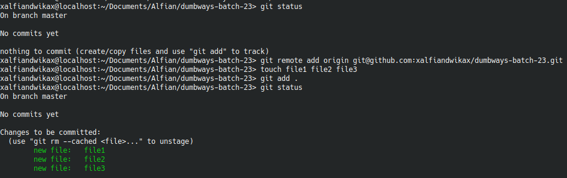

# 1. Penjelasan tentang Git

**Git** adalah sistem **version control terdistribusi**  untuk melacak perubahan kode sumber selama pengembangan software
## Konsep Dasar Git

1. **Repository (Repo)**  
   - Direktori proyek yang dilacak Git.  
   - Terdiri dari:  
     - **Repo Lokal** (di komputer developer)  
     - **Repo Remote** (contoh: GitHub/GitLab)  

2. **Commit**  
   - Snapshot perubahan dengan:  
     - ID unik (hash)  
     - Pesan commit (*commit message*)  

3. **Branch**  
   - Cabang independen kode sumber.  
   - Contoh:  
     - `main`/`master` (branch utama) 
     - `developer` (branch untuk para developer)   
     - `feature/login` (branch pengembangan fitur)  

4. **Merge**  
   - Menggabungkan perubahan antar branch.  

5. **Staging Area**  
   - Area persiapan sebelum commit (`git add .`). 

# 2. Buat sebuah repository bernama "dumbways-batch-23" yang berisi 3 file

1. Login ke akun GitHub
2. Buat repository baru dengan klik button **New Repository**
3. Isi form:
   - Repository Name: `dumbways-batch-23`
4. Klik tombol **Create Repository**
5. buat direktori dengan nama yang sama di lokal, kemudian initialisasi git di direktori tersebut dan remote repository yang telah dibuat dengan mengetikkan perintah:
   ```bash
   git init dumbways-batch-23 
   git remote add origin git@github.com:xalfiandwikax/dumbways-batch-23
   ```
 > 
>  >  


6. buat 3 file, lalu push ke repository menggunakan command:

```bash
touch file1 file2 file3
git add .
git commit -m "pesan"
git push origin master
```


