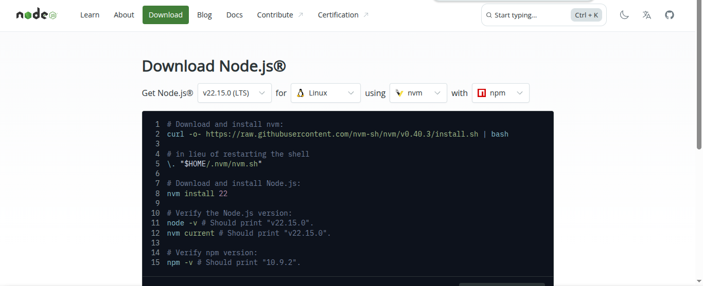

## 1. Deploy app wayshub-frontend node.js
1. **install node js**  
   - buka website node js https://nodejs.org/en/download
   
   - Download menggunakan curl dengan perintah

   ```bash
   curl -o- https://raw.githubusercontent.com/nvm-sh/nvm/v0.40.3/install.sh | bash
   ```
     - ikuti petunjuk yang berada di halaman resmi
       
     - nge-clone repositori wayshub-frontend dengan perintah ```git clone git@github.com:dumbwaysdev/wayshub-frontend.git```
     - setelah itu masuk kedalam direktori wayshub-frontend ``` cd wayshub-frontend ```
     - kita ubah script package.json pada bagain scripts menjadi seperti ini
     ```bash
       "scripts": {
         "start": "PORT=4000 react-scripts start",
         "build": "react-scripts build",
         "test": "react-scripts test",
         "eject": "react-scripts eject"
        }
     ```
     diakarenakan disini saya sedang menjalankan App berada di por 3000
     - lalu kita install depedenci yang dibutuhkan aplikasi dengan perintah ```npm install```
     
     - setelah berhasil kita lakukan untuk export host dengan perintah ``` export HOST=localhost``` agar sistem membaca berjalan di localhost. lalu kita restart bash dengan perintah ``` exec bash ```
        
     - jalankan perintah ```npm start``` unruk menjalankan app.
     

## 2. Deploy Python 
1. **install python**  
     - install terlebih dahulu pip (package manager python) dengan perintah ```sudo zypper install python3-pip```  
     
     - buat direktori bernama python ``` mkdir python```
     - masuk kedalam direktori python ``` cd python ```
     - install liblary flask dengan perintah ``` pip install flask```
     
     - buat file python di dalam direktori python dengan perintah ``` touch index.py```
     - isi file tersebut dengan 
     ```bash
     from flask import Flask

     app = Flask(__name__)

     @app.route('/')
     def index():
     return 'Halo disini Alfian'

     app.run(host='0.0.0.0', port=5000)

     ```
     - lalu jalankan perintah ``` python3 index.py```
     

## 3. Deploy Golang 
1. **install Golang**  
   - download file .tar.gz di website golang [golang](https://go.dev/dl/) menggunakan perintah ```wget https://go.dev/dl/go1.24.2.linux-amd64.tar.gz```
   - buka dokumentasi instalasi golang>
   
   -  masuk ke super user dengan perintah ```sudo su```
   -  ketik perintah ```rm -rf /usr/local/go && tar -C /usr/local -xzf go1.24.2.linux-amd64.tar.gz``` untuk mengextrax file .tar.gz
   - keluar dari super user dengan ```CTRL+d``` lalu ketik perintah ```export PATH=$PATH:/usr/local/go/bin``` untuk menambahkan PATH di environment variabel
   - lalu ketik perintah ``` go version ``` untuk melihat versi golang.
   
1. **Menjalankan Golang**
   - buat direktori golang ``` mkdir golang ``` lalu buat file sekaligus membuat script golang dengan perintah ``` nano index.go```
   - isi dengan script
   ```bash
         package main

         import (
            "log"
            "net/http"
         )

         func main() {
            // Handler untuk route utama
            http.HandleFunc("/", func(w http.ResponseWriter, r *http.Request) {
               w.Header().Set("Content-Type", "text/html")
               _, err := w.Write([]byte(`
                  <!DOCTYPE html>
                  <html>
                  <head>
                     <meta charset="UTF-8">
                     <title>Go Web Server</title>
                  </head>
                  <body>
                     <h1>Golang Geming!</h1>
                  </body>
                  </html>
               `))
               if err != nil {
                  log.Printf("Error writing response: %v", err)
               }
            })

            // Jalankan server di port 8080
            log.Println("Server running on :8080")
            log.Fatal(http.ListenAndServe(":8080", nil))
         }
   ```
   - ketikan perintah ``` go run index.go```
   
 


