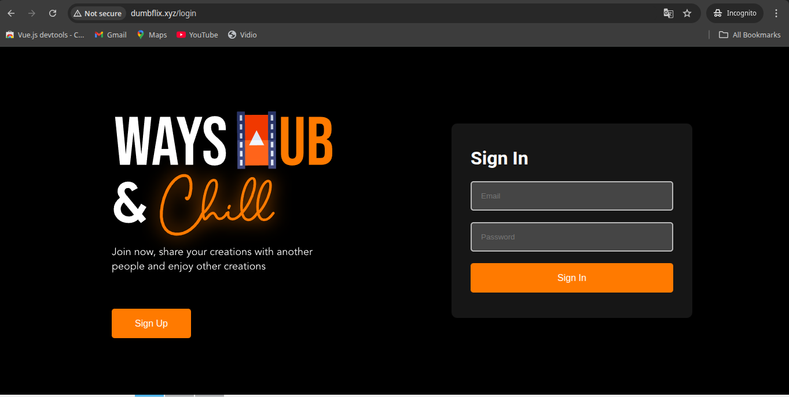
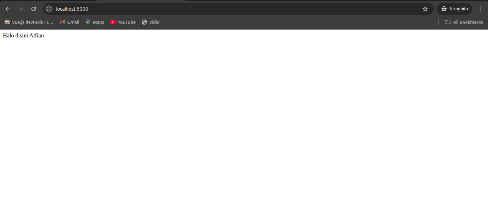
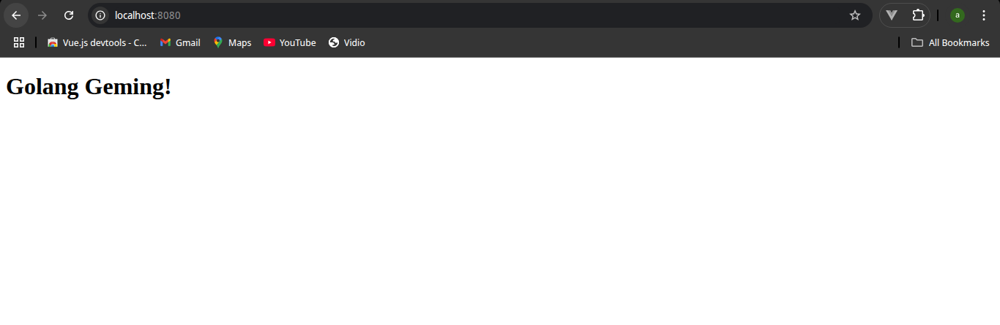

## 1. NodeJS + Python berjalan di background (tanpa kondisi attached di terminal)
1. **instalasi PM2**
 -  install pm2 dengan printah ``` npm install pm2@latest -g```
2. ***Menjalankan Aplikasi didalam Pm2***
**nodejs**
 -  setelah berhasil menginstall pm2, sekarang kita menjalankan node.js di dalam pm2 dengan perigi ke direktori proyek node.js kita ``` cd wayshub-frontend```
 - setelah berada di direktori proyek node.js. kita pastikan terlebih dahulu versi node js sesuai dengan kebutuhan proyek kita, dalam hal ini kita membutuhkan versi node.js 13, kita bisa mengetikan perintah ``` nvm install 13 ```
 - setelah berhasil terinstall kita export host telbih dahulu untuk memastikan app node.js kita berjalan di localhost dengan mengetikan perintah ``` export HOST=localhost``` jangan lupa untuk merefresh bash dengan perintah ``` exec bash ```
 - setelah kita melakukan export host kita jalankan node.js di dalam pm2 dengan perintah ``` pm2 start npm --name "wayshub-frontend" -- start ```
 - 
 - dan sekarang sudah berjalan 

 **python**
 - untuk menjalankan python didalam pm2 pertama kita pergi ke direktori python yang di dalamnya mempunya file index.py ``` cd python ```
 - setelah berada didalem direktori python ketik printah ``` pm2 start index.py --name "python" ```
 - setelah itu buka browser dengan url ``` localhost:5000 ``` 
 - 

 **menjalankan golang**
 - pergi ke direktori golang yang terdapat file ``` index.go```
 - ketikan perintah ``` go run index.go```
 - pergi ke browser dengan url ``` localhost:8080```
 - 