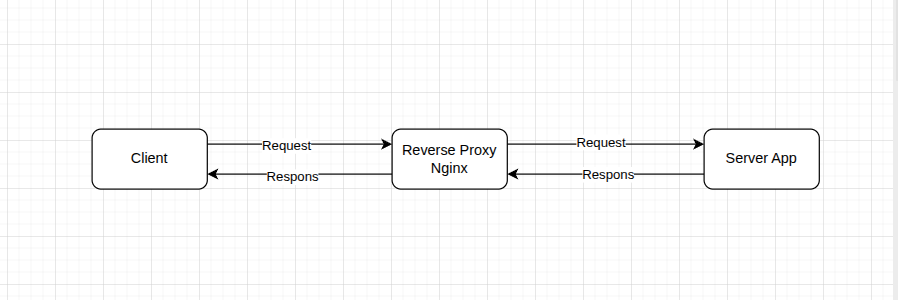
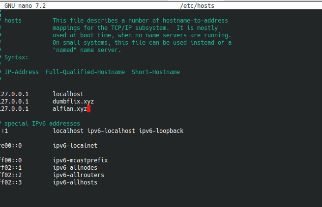
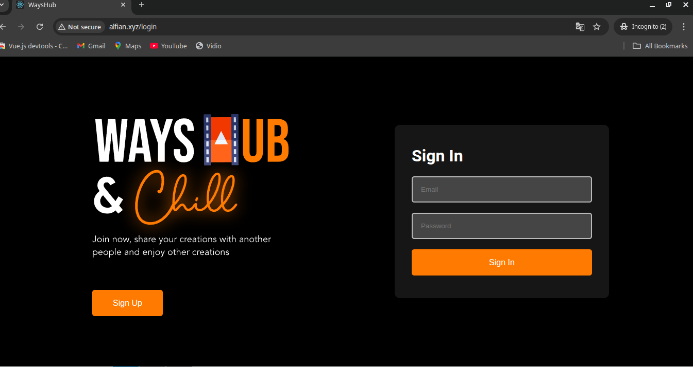

## 1. Gambarkan sturktur web server menggunakan reverse proxy dan jelaskan cara kerjanya!

1. CLient membuka browser akses https://alfian.xyz
2. Reverse proxy (Nginx):
   - Menerima request
   - Cek aturan routing:
      - /game → Go app (port 8080)
      - /api → Node.js (port 3000)
      - /blog → Python (port 8000)
3. Mengirim request ke backend yang sesuai ip dan port
4. Backend memproses dan mengembalikan response
5. Reverse proxy meneruskan response ke browser Client

***Kelebihan***
- Client hanya berinteraksi dengan 1 pintu masuk
- Backend server bisa di-upgrade/diubah tanpa client tahu
- Bisa menangani ratusan backend dengan 1 domain
 
## 2.Buatlah Reverse Proxy untuk aplilkasi yang sudah kalian deploy kemarin. (wayshub), untuk domain nya sesuaikan nama masing" ex: alvin.xyz .
1. **atur hosts**
   - buka direktori dan edit file hosts dengan perintah ``` sudo nano /etc/host```
   - tambahkan routes domain ``` 127.0.0.1      alfian.xyz```
   - 
2. **atur configurasi NGinx**
   - buka folder ``` /etc/nginx/sites-available```
   - buat file lalu masukan scrpt configurasi nginx dengan cara ``` sudo nano alfian.conf```
   - masukan script 
   ```bash
        server {
         server_name alfian.xyz;
           location / {

                proxy_pass http://localhost:4000;
          }

                }

   ```
   - buat symlink dengan perintah ```sudo ln -s /etc/nginx/sites-available/alfian.conf /etc/nginx/sites-enabled/```
   - buka di browser dengan new incognito dengan domain ``` alfian.xyz```
   - 