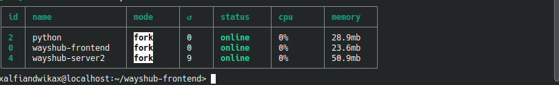
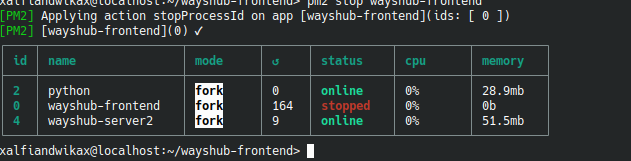
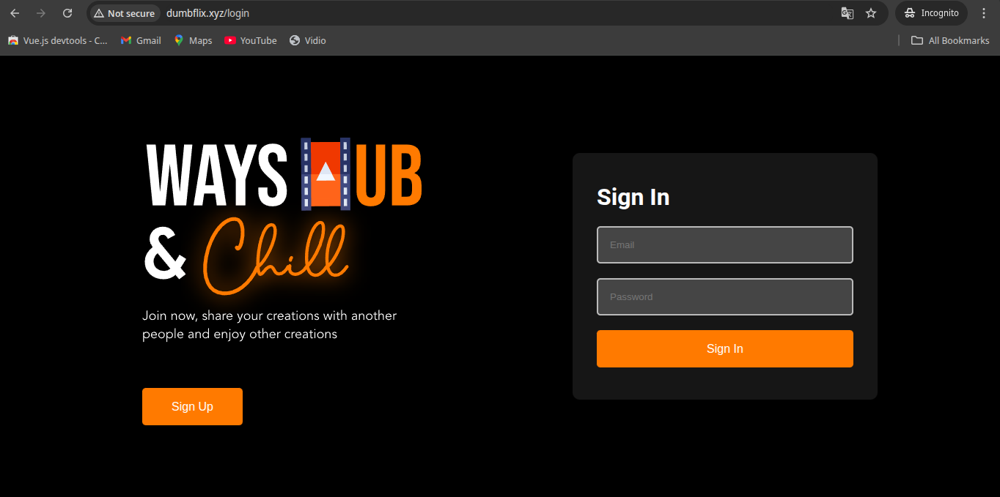

## 1. implementasikan load balancing kepada aplikasi wayshub yang telah kalian gunakan. (Gunakan 2 server)

- saya mencobanya dengan PM2 dengan cara mengubah configurasi di file ``` /etc/nginx/site-enabled/dumbflix.xyz```
- atur upstrem dengan variabel nodeserver
```bash
        upstream nodeserver{

        server localhost:3000;
        server localhost:3001;


        }


        server {
        server_name dumbflix.xyz;
                location / {

                        proxy_pass http://nodeserver;
                        proxy_set_header Host $host;
                        proxy_set_header X-Real-IP $remote_addr;
                }

        }

```

- lalu kita jalankan lagi proyek node.js dengan pm2 namun kita atur berjalan di port 3001 dengan perintah ``` pm2 start npm --name "wayshub-server2" -- start --port 3001 ```
- 
- disaat kita coba stop salah satu server dengan perintah ``` pm2 stop wayshub-frontend``` maka hasilnya
- 
- masih bisa berjalan
- 
 